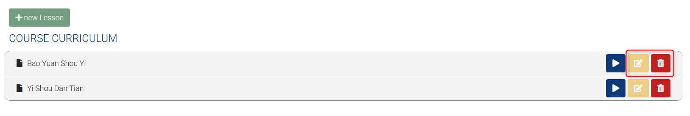
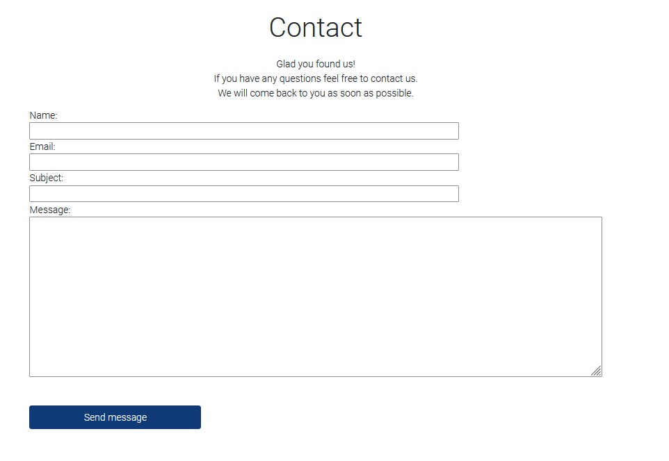
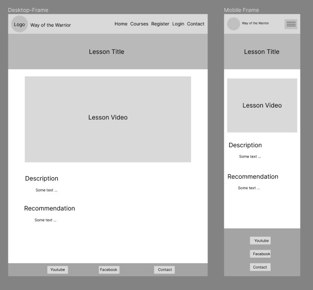

# Gong Fu Online - Courses

Gong Fu Online - Courses is a fictional Kung Fu School, which is offering teaching people online the art of martial arts. The app is a online course management system designed to allow staff to easily manage the courses and bookings. It allows users to simply register and login to this website and start to learn Kung Fu step by step. 
The live link can be found here: [Live Site - Gong Fu Online - Courses](https://pbrdys-gong-fu-online-courses-a434364e81b0.herokuapp.com/)


## Table of Contents
- [Gong Fu Online Academy](#Gong-Fu-Online-Courses)
  - [Table of Contents](#table-of-contents)
- [User-Experience-Design](#user-experience-design)
  - [The-Strategy-Plane](#the-strategy-plane)
    - [Site-Goals](#site-goals)
    - [Agile Planning](#agile-planning)
      - [Epics](#epics)
      - [User Stories](#user-stories)
  - [The-Scope-Plane](#the-scope-plane)
  - [The-Structure-Plane](#the-structure-plane)
    - [Features](#features)
    - [Features Left To Implement](#features-left-to-implement)
  - [The-Skeleton-Plane](#the-skeleton-plane)
    - [Wireframes](#wireframes)
    - [Database-Design](#database-design)
    - [Security](#security)
  - [The-Surface-Plane](#the-surface-plane)
    - [Design](#design)
    - [Colour-Scheme](#colour-scheme)
    - [Typography](#typography)
    - [Imagery](#imagery)
  - [Technolgies](#technolgies)
  - [Testing](#testing)
  - [Deployment](#deployment)
    - [Version Control](#version-control)
    - [Heroku Deployment](#heroku-deployment)
    - [Run Locally](#run-locally)
    - [Fork Project](#fork-project)
  - [Credits](#credits)

# User-Experience-Design

## The-Strategy-Plane

### Site-Goals

The sites main goal is to provide a way to learn kung fu from everywhere for everyone.
Everyone can register, sign in and enjoy the content of all available courses. 

The site also aims to provide an easy way for the owner to manage all courses and lessons. 

### Agile Planning

This project was developed using agile methodologies by delivering small features incrementally.

All projects were assigned to epics, prioritized under the labels, Must have, should have, could have. They were story pointed according to complexity from 1 to 8. 1 equals very easy and 8 equals very hard. "Must have" stories were completed first, "should haves" and then finally "could haves". It was done this way to ensure that all core requirements were completed first to give the project a complete feel, with the nice to have features being added should there be capacity.

The Kanban board was created using github projects and can be located [here](https://github.com/users/pbrdys/projects/2/) and can be viewed to see more information on the project cards. All stories except the documentation tasks have a full set of acceptance criteria in order to define the functionality that marks that story as complete.


#### Epics

The project had 7 main Epics (milestones):

**EPIC 1 - Base Setup**

The base setup epic is for all stories needed for the fundamental set up of the application. Without the base setup, the app would not be possible so it was the first epic to be delivered as all other features depend on the completion of the base setup.

**EPIC 2 - Stand alone Pages**

The stand alone pages epic is for small pages that did not have enough stories to warrant their own full epics. Instead of creating epics for tiny features, these small deliverables were all added under this epic.

**EPIC 3 - Authentication Epic**

The authentication epic is for all stories related to the registration, login and authorization of views. This epic provides critical functionality and value as without it the owner and staff would not be able to managed the courses and lessons securely without regular site visitors also being able to see and perform actions.

**EPIC 4 - Courses**

The courses epic is for all stories that relate to the creating, deleting, editing and viewing of courses. This allows for regular users to view courses and for staff to manage them with a simple UI interface.

**EPIC 5 - Lessons**

The Lessons epic is for all stories that relate to creating, viewing, updating and deleting lessons that are being assigned to courses. This allows the staff to easily manage lessons and assign them to courses.

**EPIC 6 - Deployment Epic**

This epic is for all stories related to deploying the app to heroku so that the site is live for staff and students use.

**EPIC 7 - Documentation**

This epic is for all document related stories and tasks that are needed to document the software development lifecycle of the application. It aims to deliver quality documentation, explaining all stages of development and necessary information on running, deploying and using the application.

#### User Stories

The following user stories (by epic) were completed:

**EPIC 1 - Base Setup**

As a developer, I need to set up the project so that it is ready for implementing the core features

As a developer, I need to create the base.html page and structure so that other pages can reuse the layout

As a developer, I need to create the navbar so that users can navigate the website from any device

As a developer, I need to create the footer with all necessary information

As a developer, I need to create static resources so that images, css and javascript work on the website

**EPIC 2 - Stand alone Pages**

As a developer, I need to implement a 404 error page to alert users when they have accessed a page that doesn't exist

As a developer, I need to implement a 500 error page to alert users when an internal server error occurs

As a developer, I need to implement a 403 error page to redirect unauthorised users to so that I can secure my views

As an owner, I would like a home page so that people can view information on what my page has to offer

As an owner, I would like a contact page so that people can contact me easily with questions about my offered courses

**EPIC 3 - Authentication Epic**

As a developer, I need to implement allauth so that users can sign up and have access to the websites features

As a site owner, I would like the allauth pages customized to that they fit in with the sites styling

**EPIC 4 - Courses**

As a staff user, I want to be able to create a new course

As a staff user, I want to be able to edit a course when updates are needed

As a staff user, I want to be able to delete a course when it is no longer used

As a user, I would like to be able to view courses so that I can decide if I would like to register at this page to learn what it has to offer

**EPIC 5 - Lessons**

As a staff user, I want to be able to create a new lessons and add them to a course

As a staff user, I want to be able to edit a lesson when updates are needed

As a staff user, I want to be able to delete a lesson when it is no longer used

As a authenticated user, I would like to see an overview of all lessons available within one course

As a authenticated user, I would like to be able to view content of lessons


**EPIC 6 - Deployment Epic**

As a developer, I need to set up whitenoise so that my static files are served in deployment

As a developer, I need to deploy the project to heroku so that it is live for customers

**EPIC 7 - Documentation**

Tasks:

* Complete readme documentation
* Complete testing documentation

## The-Scope-Plane

* Responsive Design - Site should be fully functional on all devices from 320px up
* Hamburger menu for mobile devices
* Ability to perform CRUD functionality on Courses and Lessons
* Restricted role based features
* Home page with information about the kung fu teaching

## The-Structure-Plane

### Features

``USER STORY - As a developer, I need to create the navbar so that users can navigate the website from any device``

Implementation:

**Navigation Menu**

 The Navigation contains links for Home, Courses, Contact and has allauth options.

The following navigation items are available on all pages:
  * Home -> index.html - Visible to all
  * Courses -> course_overview.html - Visible to all
  * Login -> login.html - Visible to logged out users
  * Register -> signup.html - Visible to logged out users
  * Logout -> logout.html - Visible to logged in users
  * Contact -> contact.html - Visible to all

The navigation menu is displayed on all pages and drops down into a hamburger menu on smaller devices. This will allow users to view the site from any device and not take up too much space on mobile devices.


<hr>

``USER STORY - As an owner, I would like a home page so that people can view information on what my page has to offer``

Implementation:

**Home Page**

**Section - Hero**
The home page contains a hero image that is illustrating the way of the warrior. This will immediately make it evident to the user, what the purpose of the website is.


<hr>

**Section - Introduction**
This section aims to motivate and guide the visitor to take the first step towards mastering ancient martial arts through those offered online courses. It contains a prominent registration button that invites to join and begin the training. 


<hr>

**Section - Offering**
This section is crafted to give the visitor a comprehensive understanding of the valuable resources and support they will receive when they join our program.


<hr>

**Section - Training**
This section is designed to guide the visitor through a disciplined and rewarding training journey, ensuring a deep and enduring development of proficiency in the art of Wudang Gong Fu. The training program is structured into three levels of difficulty, each designed to be completed over approximately one year. The training emphasizes a well-founded education in martial arts, focusing on fundamental skills and progressive development.


<hr>

**Section - Styles**
This section provides a detailed introduction to the various styles of Wudang Kung Fu, each offering a unique path to mastering the art. Through understanding the distinct characteristics and philosophies of each style, the visitor can choose the path that best aligns with his martial arts journey.


<hr>

``USER STORY - As a developer, I need to create the footer with social media links and contact information``

Implementation:

**Footer**

A footer has been added to the bottom of the site, this contains a Youtube and Facebook link so that users can follow the school on social media if they want to keep up to date with special offers not advertised on the website. These icons have aria-labels added to ensure users with assistive screen reading technology know what the purpose of the links are for. They also open in new tabs as they lead users away from the site.


<hr>

``USER STORY - As a user, I would like to be able to view courses so that I can decide if I would like to register at this page to learn what it has to offer``

Implementation:

**View Courses Page (Course overview)**

A course overview has been implemented to allow users to see the current available courses.
This is visible to all users regardless of logged in state as it is not user friendly to restrict core information from users to force them into signing up.


<hr>

``USER STORY - As a staff user, I want to be able to create a new course``

Implementation:

**Create New Course**

A create course page was implemented to allow staff users to create new courses via the UI without having to use the backend admin panel. This will give staff the ability to quickly update courses when they have to make changes.


<hr>

``USER STORY - As a staff user, I want to be able to edit a course when updates are needed``
``USER STORY - As a staff user, I want to be able to delete a course when it is no longer used``

Implementation:

**Edit / Delete Course**

On the course overview are buttons implemented that allow the staff user to edit or delete a course.
This buttons are only visible to staff member. Regular users are not allowed to perform those actions.


<hr>

``USER STORY - As a authenticated user, I would like to see an overview of all lessons available within one course``

Implementation:

**View Lessons (Curriculum)**

Lessons can be views within a course. They are called the curriculum of that course. The user has to enter the course detail page to be able to view the curriculum. This area is only accessible for logged in users.


<hr>

``USER STORY - As a staff user, I want to be able to create a new lesson``

Implementation:

**Create New Lesson**

A create lesson page was implemented to allow staff users to create new lessons via the UI without having to use the backend admin panel. This will give staff the ability to quickly update lessons when they have to make changes.


<hr>

``USER STORY - As a staff user, I want to be able to edit a lesson when updates are needed``
``USER STORY - As a staff user, I want to be able to delete a lesson when it is no longer used``

Implementation:

**Edit / Delete Lesson**

On the course detail page are buttons next to every displayed lesson available. Those buttons allow staff user 
to edit or delete a lesson. This buttons are only visible to staff user. Regular users are not allowed to perform those actions.



<hr>

``USER STORY - As an owner, I would like a contact page so that people can contact me easily with questions about my offered courses``

Implementation:

**Contact**

On the contact page is a form implemented, which allowes everyone to send a message to the owner of this page. The messages will be stored within the database.



<hr>

**Error Pages**

``USER STORY - As a developer, I need to implement a 404 error page to alert users when they have accessed a page that doesn't exist``

Implementation:

**404 Page**

As a developer, I need to implement a 404 error page to redirect users to.

A 404 page has been implemented and will display if a user navigates to a broken link.

The 404 page will allow the user to easily navigate back to the main website if they direct to a broken link / missing page, without the need  of the browsers back button.


<hr>

``USER STORY - As a developer, I need to implement a 403 error page to redirect unauthorised users to so that I can secure my views``

Implementation:

**403 Page**

A 403 error page has been implemented to provide feedback to the user when they try to access unauthorized content. Users will be directed to this page if they alter the URL's and attempt to edit, delete or access pages that are restricted. 

This covers:
* View Course Detail - Only signed in users
* Add Course - Only authorized to staff
* Edit Course - Only authorized to staff
* Delete Course - Only authorized to staff
* View Lesson Detail - Only signed in users
* Add Lesson - Only authorized to staff
* Edit Lesson - Only authorized to staff
* Delete Lesson - Only authorized to staff


<hr>

``USER STORY - As a developer, I need to implement a 500 error page to alert users when an internal server error occurs``

Implementation:

**500 Page**

A 500 error page has been displayed to alert users when an internal server error occurs. The message relays to users that the problem is on our end, not theirs.


**Base Setup User Stories**

The following stories were implemented in order to set up a base structure for all the HTML pages and the core installations and configurations needed to run the application. While these do not show as individual features, they were stories completed that were needed to implement all of the stories above.

``As a developer, I need to create the base.html page and structure so that other pages can reuse the layout``

``As a developer, I need to create static resources so that images, css and javascript work on the website``

``As a developer, I need to set up the project so that it is ready for implementing the core features``

**Favicon**

A favicon was added the website to enable users to easily locate the website in the browser when multiple tabs are open.

Favicon
    * A site wide favicon was implemented.
    * This provides an image in the tabs header to allow the user to easily identify the website if they have multiple tabs open.


### Features Left To Implement
- Show user the progress of each course, based on the finished lessons.
- Currently, the student has access to all courses from the beginning. In the future, I would like to set some rules that grant the user access to specific courses based on their membership duration.
- Implement a better and easier navigation within the courses and lessons.
- Notification for the owner about new contact form messages.


## The-Skeleton-Plane

### Wireframes

* **Home page**
Contains a lot of information about the teaching and the courses that will be offered on this platform.


* **Contact page**
Simple page with a contact form. 


* **Sign Up page**
Use the all_auth sign-up page and ensure its design complements the overall aesthetic of the site.


* **Sign In page**
Use the all_auth sign-in page and ensure its design complements the overall aesthetic of the site.


* **Sign Out page**
Use the all_auth sign-out page and ensure its design complements the overall aesthetic of the site.


* **Course Overview page**
Course Overview contains basically a list of courses that are available on this website. 
A course is represented within a card (image, description, action-buttons).
The buttons for adding, editing or deleting a course, are only visible for staff member. 


* **Course Detail page**
Course description will be displayed in this view as well as the lessons. 
The action buttons for adding, editing or deleting a lesson are only visible for staff member.


* **Course/Lesson Add and Edit page**
The course add page and the course edit page are the same. The only difference is that the add page has an empty form, while the edit page has a prefilled form. The pages for adding or editing a lesson are equal to the course pages. The difference here are just different fields. The fields are being created dynamically based on the model.


* **Lesson Detail page**
The lessons video will be displayed here, as well as some additional information.


**Differences to Design**
- Lesson Detail page: Added two banner (top and bottom) to this page for better look and feel of this page.

### Database-Design

The database was designed to allow CRUD functionality. This is given by using the django all_auth module. 
The table for the user is not displayed in this entity-relationship-diagram, because it wasn't modified or doesn't have any relationship to the custom created tables.

* Course table has fields that store information about the course.
* Lesson table has fields that store information about individual lessons.
* The course_id in the Lesson table is a foreign key that links each lesson to a course in the Course table, establishing a relationship between the two tables.
* Lesson has a many-to-one relationship with Course (a course can have multiple lessons, but each lesson belongs to one course).

Entity relationship diagram was created using [Microsoft Visio](https://www.microsoft.com/de-de/microsoft-365/visio/flowchart-software) and shows the schemas for each of the models and how they are related.


### Security

Views were secured by using the django authentication decorator **login_required** as well as a custom helper function **user_has_permission** and **user_is_superuser**. Those ensure that the user who is trying to access the page is authorized. Any staff restricted functionality like add/edit/delete listed in the features was secured using this method.

Environment variables were stored in an env.py for local development for security purposes to ensure no secret keys, api keys or sensitive information was added the the repository. In production, these variables were added to the heroku config vars within the project.

## The-Surface-Plane
### Design

### Colour-Scheme

* Website-Background: White (#FFF).
* Font-Color: Black (#212529).
* Buttons, some Titles where using a navy blue color (#103977). This color is the primary accent color of this website.
* navigation, footer, curriculum backgrounds were designed by using grey (#f3f3f3). This is the primary color for backgrounds on this website. 
* Then i used colors to display the level of an course. The level should indicate the difficulty of a course. 
  * Foundation: Yellow (#eac05ebb)
  * Intermediate: Green (#407950bb)
  * Advanced: Blue (#1A6F8Ebb)
* The color red (#b80707e4) was used for alert information like the 404, 403, 500 pages and the delete buttons.

All the colors are defined in the **static/css/style.css** file at the top (:root).

### Typography

The Roboto font was used throughout the website. This font is from google fonts and was imported into the style sheet.

### Imagery

The Website logo and the Hero Image were made by a friend of mine who is a graphics designer.
The images for the courses and lessons are pictures of myself and students / friends of mine.


## Technolgies

- HTML
  - The structure of the Website was developed using HTML as the main language.
- CSS
  - The Website was styled using custom CSS in an external file.
- JavaScript
  - JavaScript was used to implement the delete course and delete lesson functionality.
- Python
  - Python was the main programming language used for the application using the Django Framework.
- Visual Studio Code
  - The website was developed using Visual Studio Code IDE
- GitHub
  - Source code is hosted on GitHub
- Git
  - Used to commit and push code during the development of the Website
- Font Awesome
  - This was used for various icons throughout the site
- Figma
  - wireframes were created using Firgma from https://www.figma.com
- Microsoft Vision
  - This was used to create the Entity-Relationship-Diagram for this documentation

**Python Modules Used**

* Django Class based views (ListView, UpdateView, DeleteView, CreateView) - Used for the classes to create, read, update and delete
* messages - Used to pass messages to the toasts to display feedback to the user upon actions

**External Python Modules**

* cloudinary==1.36.0 - Cloundinary was set up for use but no custom uploads were made, settings remain for future development
* crispy-bootstrap5==0.7 - This was used to allow bootstrap5 use with crispy forms
* cryptography==42.0.5 - Installed as dependency with another package
* dj-database-url==0.5.0 - Used to parse database url for production environment
* dj3-cloudinary-storage==0.0.6 - Storage system to work with cloudinary
* Django==4.2.10 - Framework used to build the application
* django-allauth==0.57.2 - Used for the sites authentication system, sign up, sign in, logout, password resets ect.
* django-crispy-forms==2.1 - Used to style the forms on render
* gunicorn==20.1.0 - Installed as dependency with another package
* idna==3.6 - Installed as dependency with another package
* oauthlib==3.2.2 - Installed as dependency with another package
* psycopg2==2.9.9 - Needed for heroku deployment
* pycparser==2.21 - Installed as dependency with another package
* PyJWT==2.8.0 - Installed as dependency with another package
* python3-openid==3.2.0 - Installed as dependency with another package
* requests==2.31.0 - Installed as dependency with another package
* requests-oauthlib==1.4.0 - Installed as dependency with another package (allauth authentication)
* six==1.16.0 - Installed as dependency with another package
* sqlparse==0.4.4 - Installed as dependency with another package
* tzdata==2024.1 - Installed as dependency with another package
* urllib3==1.26.18 - Installed as dependency with another package
* whitenoise==6.5.0 - Used to serve static files directly without use of static resource provider like cloundinary

## Testing

Test cases and results can be found in the [TESTING.md](TESTING.md) file. This was moved due to the size of the file.

## Deployment

### Version Control

The site was created using the Visual Studio Code editor and pushed to github to the remote repository ‘gong-fu-online-courses’.

The following git commands were used throughout development to push code to the remote repo:

```git add <file>``` - This command was used to add the file(s) to the staging area before they are committed.

```git commit -m “commit message”``` - This command was used to commit changes to the local repository queue ready for the final step.

```git push``` - This command was used to push all committed code to the remote repository on github.

### Heroku Deployment

The site was deployed to Heroku. The steps to deploy are as follows:

- Navigate to heroku and create an account
- Click the new button in the top right corner
- Select create new app
- Enter app name
- Select region and click create app
- Click the resources tab and search for Heroku Postgres
- Select hobby dev and continue
- Go to the settings tab and then click reveal config vars
- Add the following config vars:
  - SECRET_KEY: (Your secret key)
  - DATABASE_URL: (This should already exist with add on of postgres)
  - CLOUNDINARY_URL: (cloudinary api url)
- Click the deploy tab
- Scroll down to Connect to GitHub and sign in / authorize when prompted
- In the search box, find the repositoy you want to deploy and click connect
- Scroll down to Manual deploy and choose the main branch
- Click deploy

The app should now be deployed.

The live link can be found here: [Live Site](https://pbrdys-gong-fu-online-courses-a434364e81b0.herokuapp.com/)

### Run Locally

Navigate to the GitHub Repository you want to clone to use locally:

- Click on the code drop down button
- Click on HTTPS
- Copy the repository link to the clipboard
- Open your IDE of choice (git must be installed for the next steps)
- Type git clone copied-git-url into the IDE terminal

The project will now have been cloned on your local machine for use.

## Credits 
* The [Website logo](static/images/warrior-logo.png) and the [Hero Image](static/images/hero-homepage.jpg) were made by a friend of mine who is a graphics designer.
* The images for the courses and lessons are pictures of myself and students / friends of mine.
Thank you for your support making this website look so pretty. 

I also want to thank Daisy Mc Girr for her support throughout my entire projects so far.