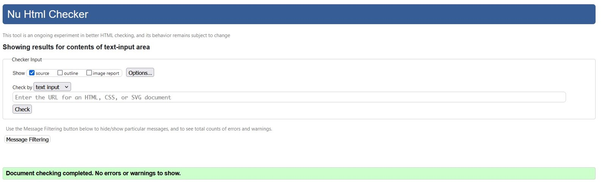
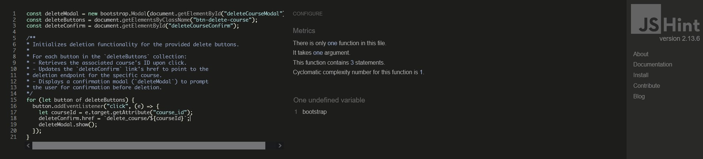
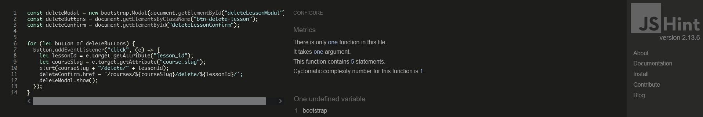

## Functional Testing

**Authentication**

Description:

Ensure a user can sign up to the website

Steps:

1. Navigate to [gong-fu-online-courses](https://pbrdys-gong-fu-online-courses-a434364e81b0.herokuapp.com/) and click Register
2. Enter email, username and password 
3. Click Sign up

Description:

Ensure a user can log in once signed up

Steps:
1. Navigate to [gong-fu-online-courses](https://pbrdys-gong-fu-online-courses-a434364e81b0.herokuapp.com/)
2. Enter login-details created in previous test case
3. Click Sign In
4. User is successfully logged in and redirected to the home page

Description:

Ensure a user can sign out

Steps:

1. Login to the website
2. Click the logout button
3. Click confirm on the confirm logout page
4. User is successfully logged out and redirected to the home page

**Course Forms**

Description:

Ensure a new course can be created.

Steps:

1. Login as super user / admin
2. Navigate to [Courses](https://pbrdys-gong-fu-online-courses-a434364e81b0.herokuapp.com/courses/)
3. Click + new course button
4. Enter the following:
    - Title: normal text
    - Slug: shouldn't contain white spaces or special signs
    - Description: normal text or html code
    - Category: choose from drop down
    - Image: upload any image, but you don't have to (default image will be used)
    - Level: choose from drop down
    - Order: any number 
5. Click Submit

Expected:

Form successfully submits and a message 'Course successfully added' should appear.
The user will be redirected to the created course.

Actual:

Form successfully submits and a message 'Course successfully added' should appear
The user will be redirected to the course overview.

 

Description:

Ensure a course can be edited.

Steps:

1. Login as super user / admin
2. Navigate to [Courses](https://pbrdys-gong-fu-online-courses-a434364e81b0.herokuapp.com/courses/)
3. Click the yellow edit button of any course you like to edit
4. You can update the following:
    - Title: normal text
    - Slug: shouldn't contain white spaces or special signs
    - Description: normal text or html code
    - Category: choose from drop down
    - Image: upload any image, but you don't have to (default image will be used)
    - Level: choose from drop down
    - Order: any number 
5. Click Submit

Expected:

Form successfully submits and a message 'Course Updated!' should appear
The user will be redirected to the course overview.

Actual:

Form successfully submits and a message 'Course Updated!' should appear
The user will be redirected to the course overview.

Description:

Ensure user can successfully delete a course.

Steps:
1. Log in as super_user
2. Navigate to [Courses](https://pbrdys-gong-fu-online-courses-a434364e81b0.herokuapp.com/courses/)
3. Click the red delete button of any course you like to delete
4. A modal window is being opened to verify your request to delete the course
4. Click the delete button to delete the course

Expected:

Course successfully deleted with the message 'Course deleted!' appearing

Actual:

Course successfully deleted with the message 'Course deleted!' appearing

**Lesson Forms**

Description:

Ensure a new lesson can be created.

Steps:

1. Login as super user / admin
2. Navigate to [Course Overview](http://127.0.0.1:8000/courses/)
3. Enter any course available
4. Click + new lesson button
5. Enter the following:
    - Title: normal text
    - Slug: shouldn't contain white spaces or special signs
    - video-url: youtube / vimeo embed url
        - [how to get this url](#get-embed-url)
    - Description: normal text or html code
    - Recommendation: normal text or html code
    - Order: any number
6. Click Submit

Expected:

Form successfully submits and a message 'Lesson successfully added' should appear.
The user will be redirected to the current course.

Actual:

Form successfully submits and a message 'Lesson successfully added' should appear.
The user will be redirected to the current course.

### Get Embed Url 
This example is made for youtube only. But it should work for vimeo kind of similar.

1. Navigate to [Youtube](https://www.youtube.com/)
2. Choose any video you like to use
3. Click the "Share" button beneath the video
4. Share window should open - choose embed 
5. Copy the url in the src part of the embed code

 

Description:

Ensure a lesson can be edited.

Steps:

1. Login as super user / admin
2. Navigate to [Course Overview](http://127.0.0.1:8000/courses/)
3. Enter any course available
4. Click the yellow edit button of any lesson you like to edit
5. Enter the following:
    - Title: normal text
    - Slug: shouldn't contain white spaces or special signs
    - video-url: youtube / vimeo embed url
    - Description: normal text or html code
    - Recommendation: normal text or html code
    - Order: any number
6. Click Submit

Expected:

Form successfully submits and a message 'Lesson successfully updated' should appear
The user will be redirected to the current course.

Actual:

Form successfully submits and a message 'Lesson successfully updated' should appear
The user will be redirected to the current course.

Description:

Ensure user can successfully delete a lesson.

Steps:
1. Log in as super_user
2. Navigate to [Course Overview](http://127.0.0.1:8000/courses/)
3. Enter any course available
4. Click the red delete button of any lesson you like to delete
5. A modal window is being opened to verify your request to delete the lesson
6. Click the delete button to delete the lesson

Expected:

Lesson successfully deleted with the message 'Lesson deleted!' appearing.

Actual:

Course successfully deleted with the message 'Lesson deleted!' appearing.

Description:

Ensure course details can be viewed

Steps:

1. Sign in as user or super user
2. Navigate to [Course Overview](http://127.0.0.1:8000/courses/)
3. Click any course available

Expected:

Course detail view is being displayed properly

Actual:

Course detail view is being displayed properly

Description:

Ensure lesson details can be viewed

Steps:

1. Sign in as user or super user
2. Navigate to [Course Overview](http://127.0.0.1:8000/courses/)
3. Click any course available
4. Click any lesson available

Expected:

Lesson detail view is being displayed properly

Actual:

Lesson detail view is being displayed properly

**Navigation Links**

Testing was performed to ensure all navigation links on the respective pages, navigated to the correct pages as per design. This was done by clicking on the navigation links on each page.

- Navigation Bar:
    - Home -> index.html
    - Contact -> contact.html
    - Courses -> course_overview.html
    - Logout -> Sign out all auth page
    - Login -> Sign in all auth page
    - Register -> Sign up all auth page
    - Register button -> Sign up all auth page

- Course Overview Page:
    - Blue button, title or image of course card -> course_detail.html
    - Green button (new course) -> course_add.html
    - Yellow button at course card -> course_edit.html
    - Red button at course card -> opening modal

- Course Detail Page:
    - Blue button or Title-> lesson_detail.html
    - Green button (new lesson) at -> lesson_add.html
    - Yellow button at course card at -> course_edit.html
    - Red button at course card at course overview -> opening modal

- Lesson Detail Page:
    - back to "course" link -> going back to the current course

All navigation links directed to the correct pages as expected.

**Footer**

Testing was performed on the footer links by clicking the font awesome icons and ensuring that the facebook icon opened facebook in a new tab and the youtube icon opened youtube in a new tab. The contact button opened the contact.html in the same tab. These behaved as expected.

## Negative Testing

Tests were performed on the create / edit a course or lesson to ensure that:

1. A staff member can not create two courses with the same slug
2. A staff member can not create two lessons with the same slug within the same course (urls always have to be unique)
3. Forms cannot be submitted when required fields are empty

## Unit Testing

Unit tests were created to test some basic functionality such as forms, urls and views. These can be found in:
    - courses/tests
        - test_forms.py
        - test_urls.py
        - test_views.py
    - contact/tests
        - test_forms.py
    - custom_pages
        - test.py

Results:
All tests were executed ``python3 manage.py test``

## Accessibility

[Wave Accessibility](https://wave.webaim.org/) tool was used throughout development and for final testing of the deployed website to check for any aid accessibility testing.

Testing was focused to ensure the following criteria were met:

- All forms have associated labels or aria-labels so that this is read out on a screen reader to users who tab to form inputs
- Color contrasts meet a minimum ratio as specified in [WCAG 2.1 Contrast Guidelines](https://www.w3.org/WAI/WCAG21/Understanding/contrast-minimum.html)
- Heading levels are not missed or skipped to ensure the importance of content is relayed correctly to the end user
- All content is contained within landmarks to ensure ease of use for assistive technology, allowing the user to navigate by page regions
- All not textual content had alternative text or titles so descriptions are read out to screen readers
- HTML page lang attribute has been set
- Aria properties have been implemented correctly
- WCAG 2.1 Coding best practices being followed

## Validator Testing

All pages were run through the [w3 HTML Validator](https://validator.w3.org/).
All pages passed validation.

Due to the django templating language code used in the HTML files, these could not be copy and pasted into the validator and due to the secured views, pages with login required or a secured view cannot be validated by direct URI. To test the validation on the files, open the page to validate, right click and view page source. Paste the raw html code into the validator as this will be only the HTML rendered code.

All pages were run through the official [CI Python Linter](https://pep8ci.herokuapp.com/) validator to ensure all code was pep8 compliant. Some errors were shown due to blank spacing and lines too long, 1 line instead of 2 expected. All of these errors were resolved and code passed through validators with the exception of the settings.py file.

Here you can view [all CI Python Linter Screenshots](doc/ci_linther/)

JavaScript code was run through [JSHINT](https://jshint.com) javascript validator. 
It flagged up issues with undefined variables. This issue can be ignored due to the variable is not undefined.

Course.js:

Lesson.js:

## Responsiveness

All pages were tested to ensure responsiveness on screen sizes from 320px and upwards as defined in WCAG 2.1 Reflow criteria for responsive design on Chrome, Edge, Firefox and Opera browsers.

Steps to test:

- Open browser and navigate to [Live Site - Gong Fu Online - Courses](https://pbrdys-gong-fu-online-courses-a434364e81b0.herokuapp.com/)
- Open the developer tools (right click and inspect)
- Set to responsive and decrease width to 320px
- Set the zoom to 50%
-  Click and drag the responsive window to maximum width

Expected:

Website is responsive on all screen sizes and no images are pixelated or stretched. No horizontal scroll is present. No elements overlap.

Actual:

Website behaved as expected.

## Bugs
Sometimes when i want to delete a course, it is redirecting me to 404 page not found. 
I couldn't figure out why this error occurs. 
It occurs randomly. Couldn't find a pattern or cause of the issue. 